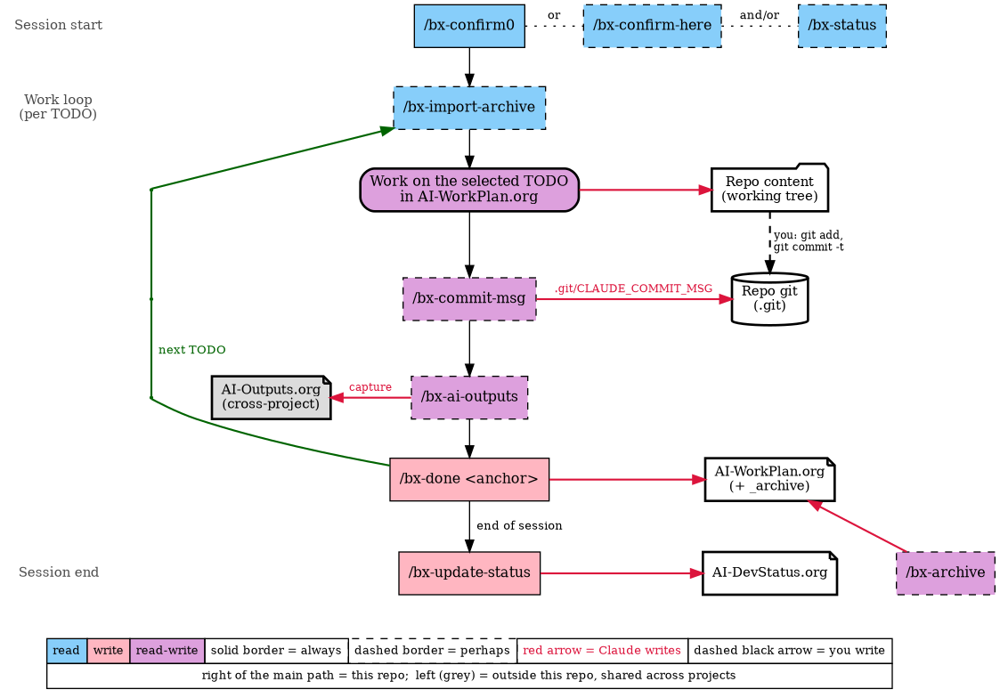

#+title: AI-Activity Usage Workflow --- Read/Write Map
#+AUTHOR: Mohsen BANAN
#+OPTIONS: toc:nil

Companion to  (source: [[file:aiUsageWorkflow-graphviz.pcs]]).

Scope: /usage of an existing setup/. Commands that create or reshape the
setup (=/bx-initiate=, =/bx-context-trim=) are out of scope here; they
belong to the startup/templates figure.

The figure draws *writes only*, as arrows. This table is the complete map:
which subject each step reads (R) and writes (W).

* Read/Write Map

| Step                            | Repo content | Repo git        | AI-WorkPlan.org (+ =_archive=) | AI-DevStatus.org | AI-Outputs.org |
|---------------------------------+--------------+-----------------+--------------------------------+------------------+----------------|
| =/bx-confirm0=                  |              |                 | R                              | R                |                |
| =/bx-confirm-here=              |              |                 | R                              | R                |                |
| =/bx-status=                    |              |                 | R                              | R                |                |
| =/bx-import-archive=            |              |                 | R (=_archive=)                 |                  |                |
| Work on the selected TODO       | RW           |                 | R                              |                  |                |
| /You:/ =git add=, =git commit=  | R            | W               |                                |                  |                |
| =/bx-commit-msg=                | R (staged)   | W (message only) |                               |                  |                |
| =/bx-ai-outputs= (index)        |              |                 |                                |                  | R              |
| =/bx-ai-outputs= (capture)      |              |                 |                                |                  | W              |
| =/bx-done <anchor>=             |              |                 | W                              |                  |                |
| =/bx-update-status=             |              |                 | R                              | W                |                |
| =/bx-archive=                   |              |                 | RW (+ W =_archive=)            |                  |                |

* Reading the Map

- *Only "Work" touches repo content.* Every =/bx-*= command manages AI
  state: WorkPlan, DevStatus, Outputs. The one exception is
  =/bx-commit-msg=, which writes a single message file.
- *Claude never commits.* =/bx-commit-msg= writes only
  =.git/CLAUDE_COMMIT_MSG=. Moving content into git (=git add=,
  =git commit -t .git/CLAUDE_COMMIT_MSG=) is yours. This is the dashed
  black arrow in the figure.
- *Locality.* Repo content, repo git, WorkPlan and DevStatus belong to
  this project, on the right of the figure. =AI-Outputs.org= is a single
  ledger shared by every project, on the left in grey. A capture there is
  visible from every other project.
- *Session start reads; session end writes.* The confirm/status commands
  load state into the session. =/bx-done= and =/bx-update-status= write
  what the session learned back to files, so the next session can start
  cold.
- *Column headings are the subjects as files.* The confirm commands
  actually read the whole =CLAUDE.md= import chain; only the two
  per-project files that change are shown.

* Fill Colours in the Figure

| Fill   | Meaning                                                  | Steps                                                                                     |
|--------+----------------------------------------------------------+-------------------------------------------------------------------------------------------|
| blue   | read: loads into the session, changes no files           | =/bx-confirm0=, =/bx-confirm-here=, =/bx-status=, =/bx-import-archive=                    |
| pink   | write: records session knowledge into files              | =/bx-done=, =/bx-update-status=                                                           |
| purple | read-write                                               | Work, =/bx-commit-msg=, =/bx-ai-outputs=, =/bx-archive=                                   |

Solid border = always; dashed border = perhaps.
